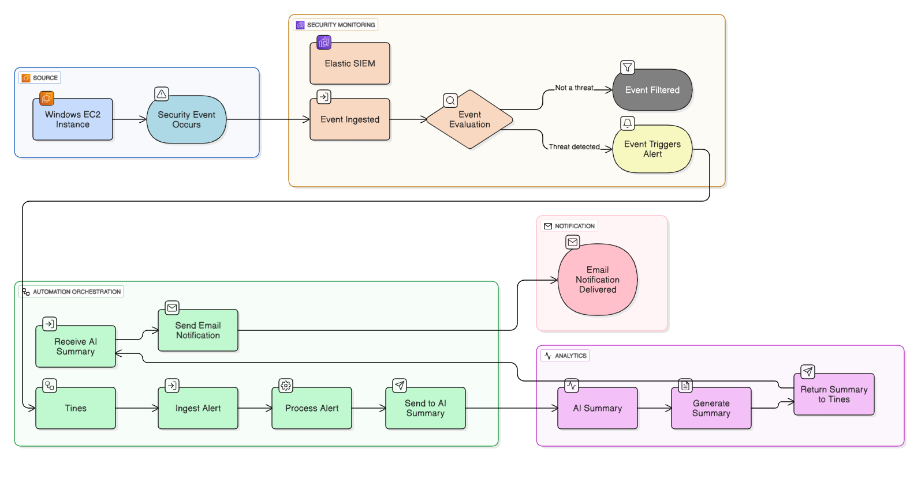
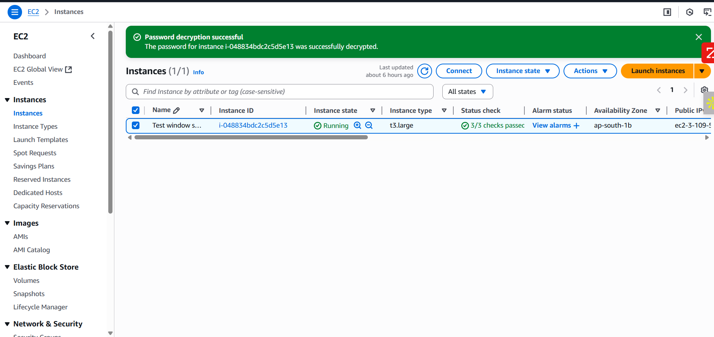
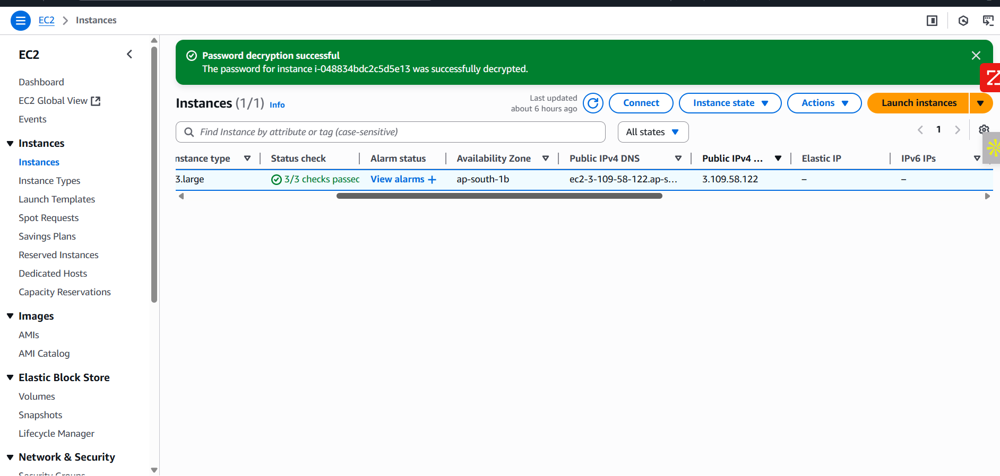
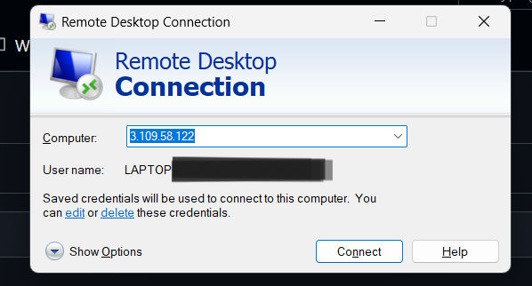
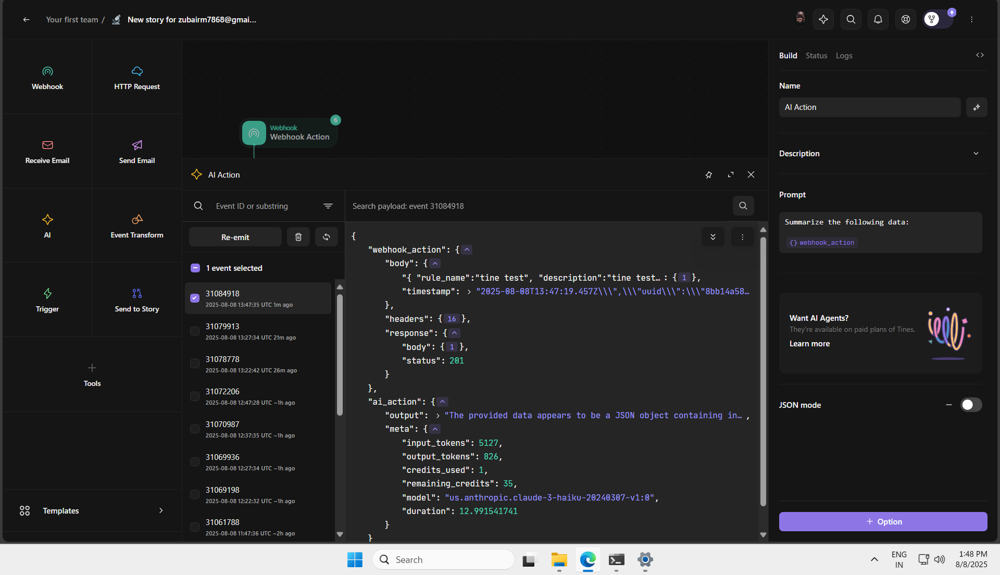
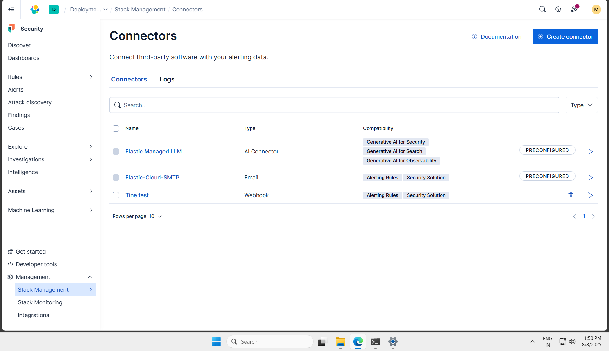
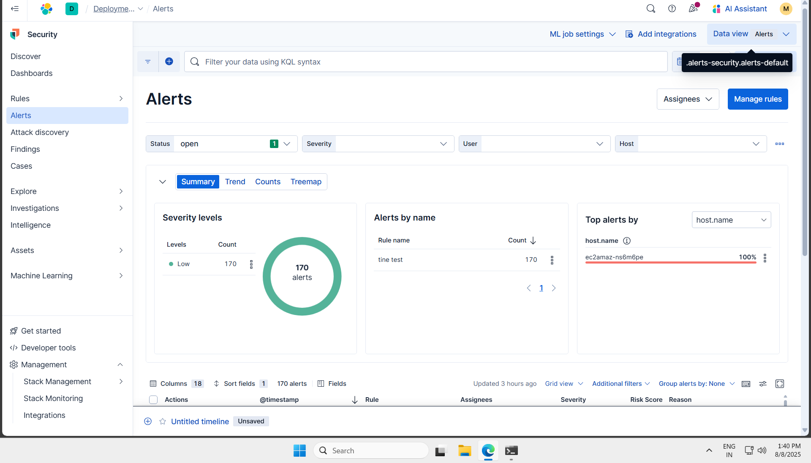

# Complete Setup Guide - SIEM AI Project

## 📋 Overview

This guide provides step-by-step instructions for setting up the complete SIEM AI integration project.

## 🎯 Setup Timeline
- **Total Time**: 1-2 hours
- **AWS Setup**: 20-25 minutes
- **Elastic SIEM**: 45 minutes
- **Tines Configuration**: 20-30 minutes
- **Testing & Validation**: 30 minutes

  ## 🔧 WorkFlow
   - 

## 🔧 Phase 1: AWS EC2 Windows Endpoint

### Step 1: Create AWS Account
1. Go to [aws.amazon.com](https://aws.amazon.com)
2. Click "Create an AWS Account"
3. Complete registration (credit card required for verification)
4. Choose "Basic Support Plan" (free)

### Step 2: Launch EC2 Instance
1. Navigate to **EC2 Dashboard**
2. Click **"Launch Instance"**
3. Configure instance:
   - **Name**: `SIEM-Windows-Endpoint`
   - **AMI**: Windows Server 2025 Base
   - **Instance Type**: `t3.medium` (4GB RAM recommended)
   - **Key Pair**: Create new key pair named `siem-project-key`
   - **Download** the `.pem` file and keep it secure
   - 
   - 


### Step 3: Configure Security Group
1. Create new security group: `SIEM-Security-Group`
2. Add inbound rules:
   ```
   Type: RDP (3389)
   Source: My IP (automatically detects your IP)
   Description: RDP access for SIEM project
   ```
   - 
   
   
3. **Launch Instance**

### Step 4: Connect to Windows Instance
1. Wait for instance to be in "running" state (2-3 minutes)
2. Select your instance → **Connect**
3. Choose **RDP client** tab
4. Click **Get Password**
5. Upload your `.pem` key pair file
6. Click **Decrypt Password**
7. Download the RDP file or use these credentials with your RDP client:
   - **Computer**: [Public IPv4 address]
   - **Username**: Administrator
   - **Password**: [Decrypted password]
   - - 

### Step 5: Initial Windows Configuration
Once connected via RDP:
1. Disable **IE Enhanced Security Configuration**:
   - Server Manager → Local Server → IE Enhanced Security Configuration → Off
2. Download and install **Google Chrome** or **Firefox**
3. Enable **Windows Remote Management**:
   ```powershell
   winrm quickconfig
   ```

## 🔍 Phase 2: Elastic SIEM Setup

### Step 1: Create Elastic Account
1. Visit [elastic.co](https://www.elastic.co)
2. Click **"Start free trial"**
3. Choose **"Elastic Security"** option
4. Complete registration with business email

### Step 2: Deploy Elastic Cloud
1. After login, click **"Create deployment"**
2. Choose:
   - **Cloud provider**: AWS
   - **Region**: US East (N. Virginia) - us-east-1
   - **Version**: Latest 8.x
   - **Template**: Security
3. **Note down** the elastic username and password (save securely!)
4. Click **"Create deployment"** (takes 5-10 minutes)
5. - 


### Step 3: Access Elastic Security
1. Once deployment is ready, click **"Open"**
2. Login with elastic credentials
3. You should see **"Security"** in the left navigation menu
4. If you see this, your Elastic SIEM is ready!

### Step 4: Create Integration Policy
1. Navigate to **Management** → **Fleet** → **Agent policies**
2. Click **"Create agent policy"**
3. Name: `Windows-Endpoints-Policy`
4. Description: `Policy for Windows endpoints monitoring`
5. Click **"Create agent policy"**

## 🤖 Phase 3: Tines SOAR Setup

### Step 1: Create Tines Account
1. Go to [tines.com](https://www.tines.com)
2. Click **"Start for free"**
3. Sign up with your email
4. Verify email and complete profile

### Step 2: Create Automation Workflow
1. After login, click **"Create Story"**
2. Name: `SIEM Alert AI Processing`
3. Description: `Automated AI analysis of SIEM alerts`
4. Click **"Create Story"**

### Step 3: Build Workflow Components
1. **Add Webhook Action**:
   - Drag **Webhook** from left panel to canvas
   - Name: `Alert Receiver`
   - Keep default settings
   - **Copy the webhook URL** (you'll need this later)
   

2. **Add AI Summarize Action**:
   - Drag **AI Summarize** to canvas  
   - Name: `AI Alert Analysis`
   - Connect it to the webhook (drag line between them)
   - - 

3. **Add Email Action**:
   - Drag **Email** to canvas
   - Name: `Send Alert Summary`  
   - Connect it to AI Summarize action
   - - 

### Step 4: Configure AI Prompt
In the AI Summarize action, set this prompt:
```
Summarize the following security alert data in one sentence. 
Provide some next action steps for the analyst to take when reviewing this alert. 
Format this into bullet points to make it easy to read the email.

Alert Data: {{.alert_receiver.body}}

Analysis Format:
• Summary: [One sentence summary]  
• Severity: [Risk level assessment]
• Next Steps: [3 specific actions]
• Indicators: [Key items to monitor]
```

## 🔗 Phase 4: Integration Configuration

### Step 1: Install Elastic Agent
1. In Elastic Security, go to **Management** → **Fleet** → **Agents**
2. Click **"Add agent"**
3. Select your `Windows-Endpoints-Policy`
4. Copy the PowerShell installation command
5. **On your Windows EC2 instance**, open PowerShell as Administrator
6. Paste and run the command
7. Wait for "Elastic Agent installed successfully" message
8. Verify in Elastic Fleet that agent shows as "Healthy"
9. - 

### Step 2: Add Elastic Defend Integration
1. In Fleet, click on your policy: `Windows-Endpoints-Policy`
2. Click **"Add integration"**
3. Search and select **"Elastic Defend"**
4. Name: `Windows-EDR-Protection`
5. Click **"Save and continue"**
6. **Save integration**
7. Agent will automatically update (2-3 minutes)

### Step 3: Create Detection Rule
1. In Elastic Security, go to **Security** → **Rules**
2. Click **"Create new rule"**  
3. Choose **"Custom query"**
4. Set rule details:
   ```
   Index patterns: logs-*
   Custom query: event.code: 4672 and winlog.event_data.PrivilegeList: *SeDebugPrivilege*
   ```
   - 
5. **Continue Setup**:
   - **Name**: `Administrative Privilege Usage Detection`
   - **Description**: `Detects when administrative privileges are assigned to accounts`
   - **Severity**: Medium
   - **Risk Score**: 47

### Step 4: Connect Elastic to Tines
1. In Elastic, go to **Management** → **Stack Management** → **Connectors**
2. Click **"Create connector"**
3. Choose **"Webhook"**
4. Configure:
   - **Name**: `Tines-Alert-Webhook`
   - **URL**: [Paste your Tines webhook URL from Step 3.3]
   - **Method**: POST
   - **Headers**: 
     ```json
     {
       "Content-Type": "application/json"
     }
     ```
     - 
     - - 

### Step 5: Configure Ru+le Actions
1. Edit your detection rule (Administrative Privilege Usage Detection)
2. Go to **Actions** tab
3. Add action: Select your `Tines-Alert-Webhook`
4. **Message body**:
   ```json
   {
     "rule_name": "{{rule.name}}",
     "rule_description": "{{rule.description}}",
     "severity": "{{rule.severity}}",
     "timestamp": "{{rule.timestamp}}",
     "host": "{{host.name}}",
     "user": "{{user.name}}"
   }
   ```
5. **Save** the rule

## ✅ Phase 5: Testing & Validation

### Step 1: Generate Test Alert
1. **On your Windows EC2 instance**, open Command Prompt as Administrator
2. Run this command to trigger the detection rule:
   ```cmd
   whoami /priv
   ```
3. The command will display current privileges, triggering Event ID 4672
4. - 

### Step 2: Verify Alert Flow
1. **Check Elastic SIEM**:
   - Go to Security → Alerts
   - You should see your "Administrative Privilege Usage Detection" alert (may take 1-2 minutes)

2. **Check Tines Workflow**:
   - In Tines, click on your story
   - Check the **Events** tab
   - You should see webhook data received

3. **Check Email**:
   - Configure email settings in Tines Email action
   - Verify AI summary email was sent
   - - 

### Step 3: Validate AI Analysis
The AI should provide analysis like:
```
• Summary: Administrative privileges were assigned to user account on Windows endpoint
• Severity: Medium risk - requires investigation  
• Next Steps: 
  - Verify if user should have admin privileges
  - Check for concurrent suspicious activities
  - Review authentication logs
• Indicators: Monitor for privilege escalation attempts
```

## 🔧 Troubleshooting Common Issues

### Elastic Agent Installation Fails
**Solution**: Ensure Windows EC2 instance has internet access and PowerShell execution policy allows scripts:
```powershell
Set-ExecutionPolicy -ExecutionPolicy RemoteSigned -Force
```

### Tines Webhook Not Receiving Data
**Solution**: Check these items:
1. Webhook URL copied correctly
2. Elastic connector configured with correct URL
3. Detection rule has actions enabled
4. Rule query is triggering alerts
   - 

### No Alerts Generated
**Solution**: 
1. Verify Elastic Agent is healthy in Fleet
2. Check Windows Event Logs are being ingested
3. Test detection rule query in Discover tab
4. Ensure rule is enabled and running

### AI Summarization Not Working
**Solution**:
1. Check Tines AI action configuration
2. Verify prompt is properly formatted  
3. Ensure webhook data is reaching AI action
4. Test AI action manually with sample data

## 📈 Success Metrics

Your setup is successful when:
- ✅ Windows EC2 instance accessible via RDP
- ✅ Elastic Agent showing as "Healthy" 
- ✅ Detection rule creating alerts
- ✅ Tines workflow receiving webhook data
- ✅ AI generating meaningful summaries
- ✅ Email notifications being sent

## 🎯 Next Steps After Setup

1. **Add More Detection Rules**: Implement additional security rules
2. **Enhance AI Prompts**: Improve analysis quality
3. **Add Integrations**: Connect to Slack, JIRA, etc.
4. **Create Dashboards**: Build security monitoring dashboards  
5. **Implement Response Actions**: Add automated remediation

## 📚 Additional Resources

- [Elastic Agent Troubleshooting](https://www.elastic.co/guide/en/fleet/current/fleet-troubleshooting.html)
- [Tines Documentation](https://help.tines.com/)
- [KQL Query Examples](https://docs.microsoft.com/en-us/azure/data-explorer/kusto/query/)
- [MITRE ATT&CK Techniques](https://attack.mitre.org/techniques/enterprise/)

## 💡 Pro Tips

1. **Save All Credentials**: Keep a secure document with all passwords and URLs
2. **Take Screenshots**: Document your progress for your portfolio
3. **Monitor Costs**: Check AWS billing regularly (should stay within free tier)
4. **Test Regularly**: Run tests weekly to ensure everything works
5. **Learn KQL**: Master Kusto Query Language for better detection rules
